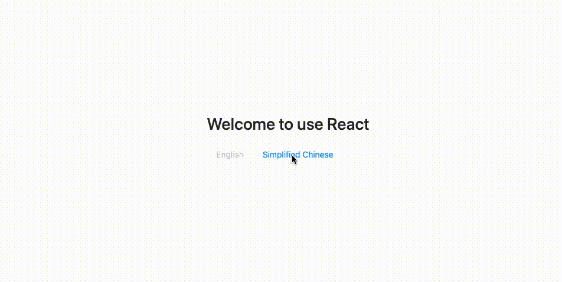

# react-intl-starter

Starter of using multiple languages (English / Simplified Chinese) with react-intl.



## How to Run

```bash
$ git clone https://github.com/kinfei/react-intl-starter.git
$ cd react-intl-starter
$ yarn install
$ yarn start
```

## How to Build

```bash
$ yarn build
```

## How to Run Production Build

```bash
$ yarn serve
```
